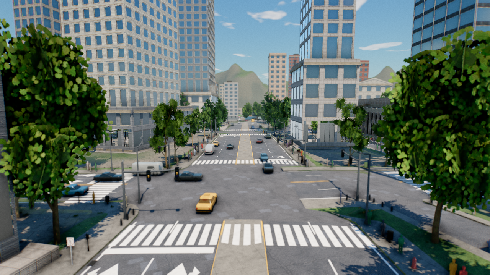
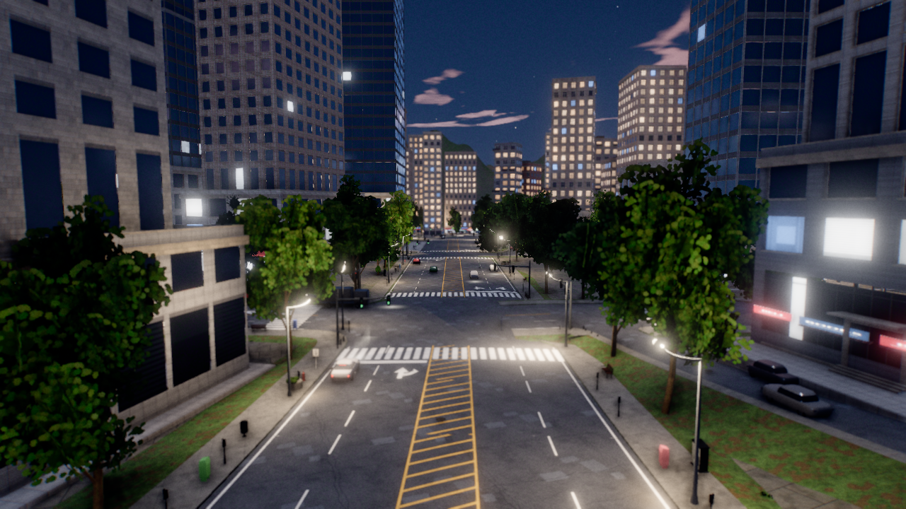
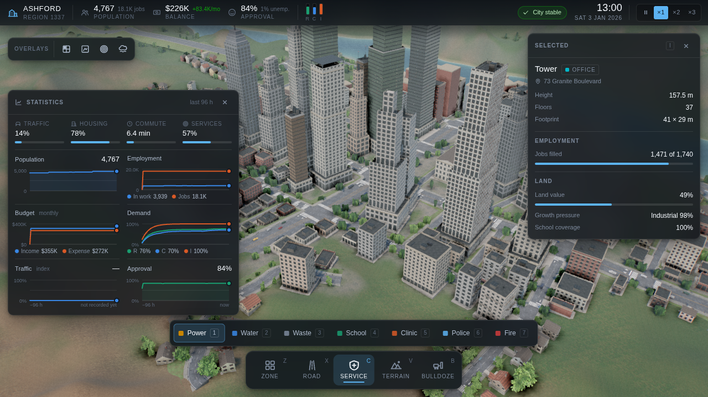
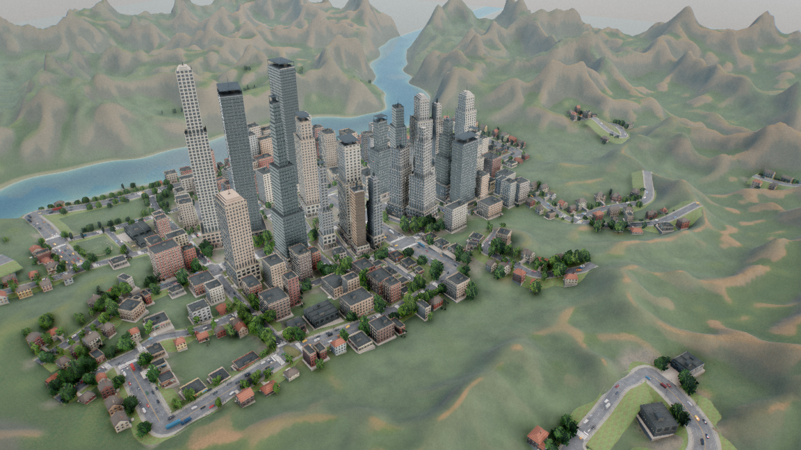

# Metropolis

A city builder that runs in the browser — Three.js and Vite, plain ES modules, no engine.

Every texture, mesh, heightfield and sound in this project is **generated procedurally in
code**. There are no binary art assets in the repository and nothing is downloaded at
runtime.


## Quick start

```bash
cd citysim
npm install
npm run dev
```

Then open <http://127.0.0.1:5173>.

> **Node 20.19+ or 22.12+ is required** — Vite 8 will not start on older versions, and the
> failure looks unrelated (`ERR_INVALID_ARG_VALUE` from `util.styleText`). If `npm install`
> leaves you with a "Cannot find native binding" error from rolldown, you are on npm 10.x
> and hitting [npm/cli#4828](https://github.com/npm/cli/issues/4828); upgrading to npm 11
> and reinstalling resolves it.

Other scripts, all run from `citysim/`:

| Command | What it does |
|---|---|
| `npm run dev` | Dev server on `127.0.0.1:5173` |
| `npm run build` | Production build to `dist/` |
| `npm run preview` | Serve the build on `127.0.0.1:4173` |
| `npm run shoot` | Headless-Chromium screenshot + metrics harness |
| `npm run gauntlet` | Module × time-of-day × camera matrix |

## Controls

| | |
|---|---|
| Camera | `W` `A` `S` `D` to move · drag to orbit · right-drag or `Shift`+drag to pan · wheel to zoom |
| Tools | `Z` zone · `X` road · `C` service · `V` terrain · `B` bulldoze |
| Panels | `Tab` statistics · `I` inspector · `P` photo mode · `H` hide UI |
| Simulation | `Space` pause · `[` slower · `]` faster |
| Editing | `Ctrl+Z` undo · `Ctrl+Y` redo · `Esc` cancel |

## What it looks like

| | |
|---|---|
|  |  |
| **Night** — 607-light clustered forward pass, window occupancy driven by the simulation | **Waterfront** — carved river, three-span bridge, hydraulic + thermal erosion |
|  |  |
| **Downtown** — 292 generated buildings, 20 m to 214 m | **Street level** — per-tenancy shopfronts, recessed glazing, wind-animated trees |
|  |  |
| **HUD** — budget, RCI demand, coverage fields, per-building inspector | **Aerial** — 2 km² seeded river-valley site |

## Repository layout

```
citysim/                 the application
  src/                   165 ES modules across 13 subsystems
  tools/                 screenshot, gauntlet and contract-check harnesses
  docs/                  architecture contract, agent briefs, critic rounds
  ARCHITECTURE.md        the contract, written before any feature code
  README.md              the full technical write-up
*.png                    showcase renders
```

**[`citysim/README.md`](citysim/README.md) is the detailed write-up** — how the project was
built, per-subsystem numbers (draw calls, tick budgets, instance counts), the rules that were
enforced during construction, and a plainly-stated list of what the project does *not* do.
[`citysim/ARCHITECTURE.md`](citysim/ARCHITECTURE.md) is the module contract.

## Notable constraints

* **`Math.random` is banned.** Everything derives from a seeded sfc32 stream, and
  `World.hash()` is order-independent so undo/redo can be asserted.
* **Modules fail soft.** A throwing module is quarantined, its group hidden, and the app
  keeps rendering.
* **The frame-rate budget has never been measured on real hardware** — the environment this
  was built in had no GPU. `src/core/Quality.js` is an adaptive governor that measures the
  real machine and degrades with hysteresis, which bounds the risk without closing it.

## License

ISC.
